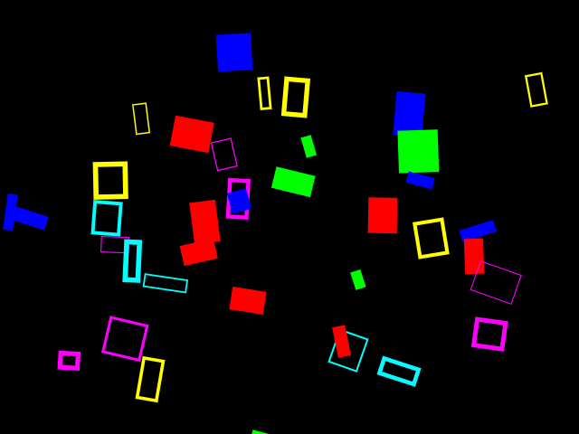

# Kuas - 2D Vector Rendering Engine

## About Kuas

Kuas is an experimental GPU-based 2D vector rendering library written in C++.
Kuas targets high-performance real-time 2D graphics applications, such as video games.

This library is under heavy development, stay tuned for any updates!

